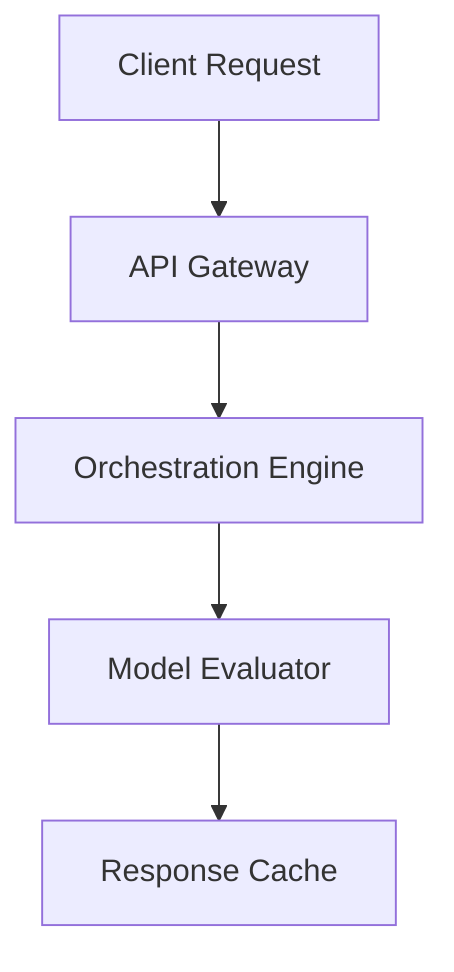

# Federated Broker Adapter Alpha

An open-source federated broker adapter alpha providing developer-friendly interfaces for cloud native workflows.

[](https://opensource.org/licenses/MIT)
[](#tech-stack)
[](#contributing)

## Features
- **Zero-trust API key management, rate limiting, and key rotation**
- **Automated payload schema validation and data sanitization**
- **Distributed state locking and consensus across worker nodes**
- **Cross-Platform**: Built on top of modern cross-platform technologies (Rust 1.75, Tokio Runtime, Serde, Clap CLI).

## Tech Stack
- Rust 1.75
- Tokio Runtime
- Serde
- Clap CLI

## Quick Start

```bash
# Clone the repository
git clone https://github.com/example/federated-broker-adapter-alpha.git

# Setup and run
cargo build --release
./target/release/main
```

## Architecture Diagram (Mermaid)


## Contributing
We welcome contributions! Please open an issue or submit a pull request for any improvements.

## License
This project is licensed under the MIT License - see the LICENSE file for details.
